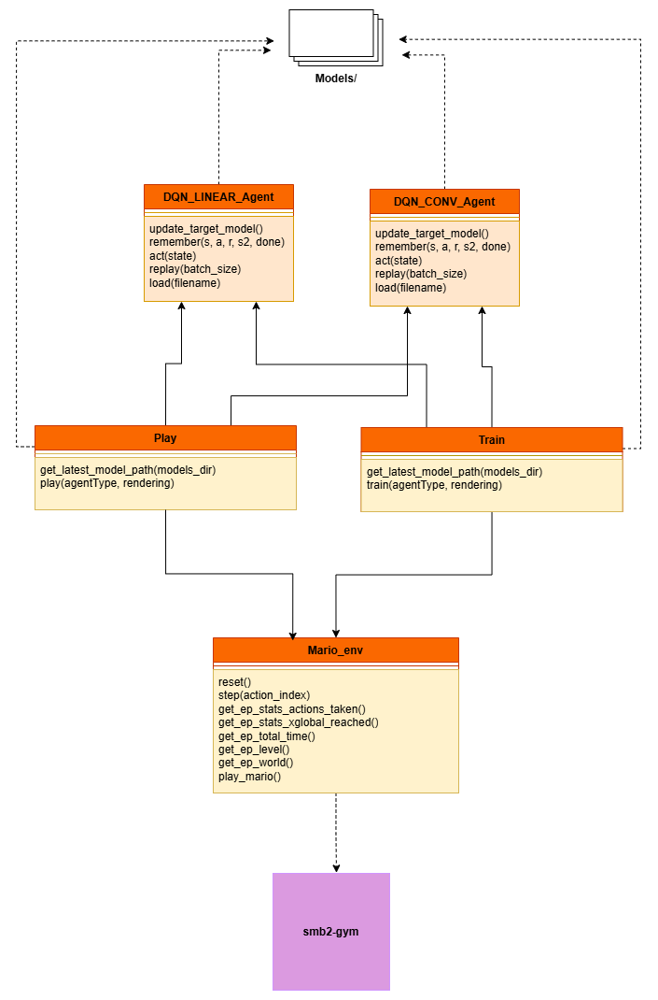

# ML_final_project

## Description
In this project we tried to train an agent to play Super Mario Bros 2. To train the agent we used pytorch and the package smb2-gym as an enviroment to train. This package gave us the observation (what is shown on the screen), the ability to do actions live in the game and also additional information about the game state that we could use for our custom reward function. From an other project we had the idea to use Deep-Q-LEARNING (DQN) implemented with a greedy epsilon algorithm. Our idea now was to test this implementation and strategy with the orioginal network (multiple linear layers) and also with a second network where we incorporated what we learned in this course. We wanted to compare the results in training and how good it plays afterwards to see which one works better for this application.  

**Option 1: DQN_LINEAR**  
In this case we kept the old network which was build of two linear layers with a ReLu layer in between. In order the use it we flattened the obersvation values that we got (3 dimensional vectors corresponding to the image: (H, W, C)) and only gave the network the flattened 1-dimensional vector as an input. Basically here it was ignored that this values actually represented a picture and we just treated them as a 1-dim. vector of numbers. 

**Option 2: DQN_CONV**  
As we learned how to deal with image classification in class and basically treated finding the best q-value as a classification (each action is a class, the image belongs to the class of the action which is the best to take in this scenario) we wanted to keep the 3-dimensional vector. So we now kept the 3-dimensional image vector and didn't flatten it before handing it to the network. In the network then we used two convolutional layers (with ReLu Layers in between) before the linear layers. We hoped this would improve the learning of the agent. 

## Structure
The following diagram shows the structure we came up with to realize or project:   

## Results
Both results were unfortunately not really good. Still the second version with the convolutional layers was better than the linaer one. The following images show the metrics achieved when letting the trained models play one demo episode.    
**1: DQN_LINEAR**  

**2: DQN_CONV**  

 More information on what we observed and discovered, as well as some limits and ideas to improve are in our presentation video: https://youtu.be/VdfhNdcz5dw. 

## The Package smb2-gym
We used the Package smb2-gym (https://pypi.org/project/smb2-gym/) to create a training enviroment for super mario bros 2. This package provided a simplified action space for mario with 12 actions to be able to have a simpler training. We counldn't find any documentation, which action is what. Based on trying it out we assumed the following meanings:    
0: Nothing  
1: Right  
2: Left  
3: Up (which enters the door)  
4: A Button (Jump)  
5: B Button (Pickup/Throw)  
6: Right + A  
7: Left + A  
8: Right + B  
9: Left + B  
10: Down (Duck)  
11: Down + A  

## How to run 
Thos project is a python project. All dependecies needed to run the project are listed in requirements.txt. 
To train the models run 'python train.py'. Then you can choose which agent should be trained. To exit savely press q. It will finish the current episode, save the data and then exit. The rendering while training is optional. To load a model and let it play run 'python play.py'. Then you can choose which agent should play or if you want to play yourself. If an angent is chosen it will play 1 episode and print metrics how it did on that episode.

## Credits
- This project is based on the idea of a project in another course ( Topics in Computer Sience). in this project we tried to train a DQN agent to play Clash Royal, but didn't reall think about the networks used and didn't compare different types. Some Files of that project were used as a base for this one (corresponding files are marked): https://github.com/adriandbf/Merge-Tactics-AI by Adrian Fudge and Vera Schmitt
- Articel we used to understand and work with DQN: https://medium.com/@samina.amin/deep-q-learning-dqn-71c109586bae

## Authors
Alina Haider  
Colin Hewlett  
Vera Schmitt  